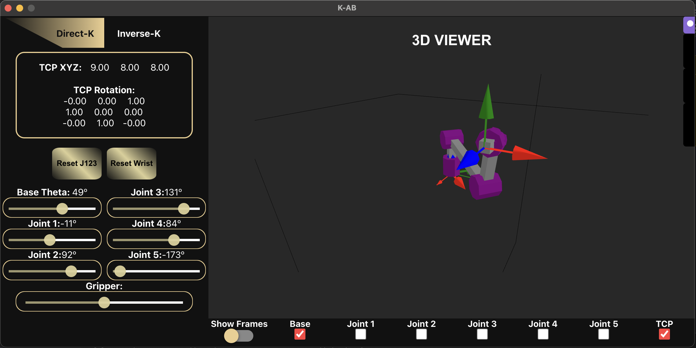
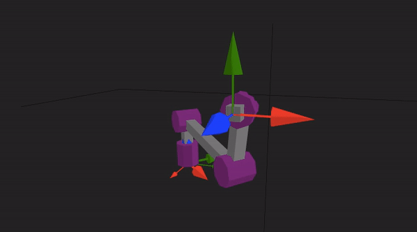
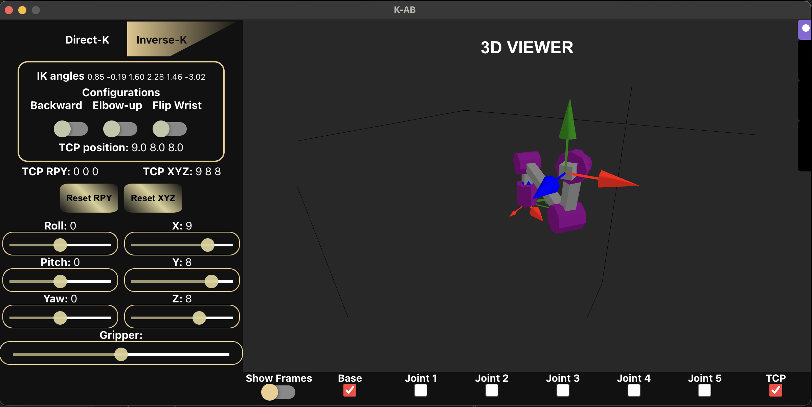

# K-AB

Welcome to the K-AB gui. This gui provides a 6 dof arm, rendered in 3d, which you can control. You decide how you want to move the arm...

either in its' joint variables

    

    

or directly controlling the Tool Center Point position and orientaiton.

    

    

This GUI is a project in progress and new functionalities and optimizations will be on the way. I am open to suggestions so feel free to make them and thank you for trying it.

*This app was built using electron and react, along with the react-plotlyjs pluging for rendering the robot.*